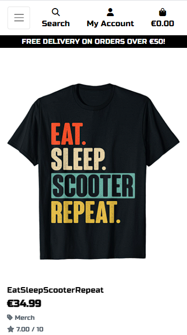
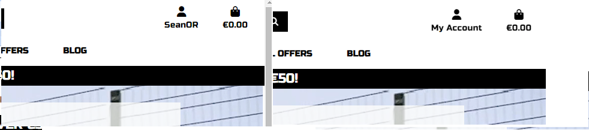

# LucaTaped

## Introduction

Luca Taped is a website designed to capitalize on the reach and popularity of the owner (Luca). To showcase his development as a stunt scooter rider and use that influence to bring potential customers onto the platform and offer a shopping experience for people who are looking to customise and enhance their own scooters.  

View live site: [LucaTaped](https://taped-8201a532e6b6.herokuapp.com/)

If you wish to make a test purchase, you can use the following [Stripe Dummy Card](https://stripe.com/docs/testing) details:

- Success Card Number: 4242424242424242
- Exp Date: Any date in the future using the format MM/YY
- CVN: any 3 digit number
- Postcode: any 5 numerals  

Any payments made using a valid debit/credit card will not be processed and the card will not be charged. No orders made will be fulfilled.

For full Admin access to Django Admin panel with relevant sign-in credentials: [LucaTaped Admin](https://taped-8201a532e6b6.herokuapp.com/admin/)

Access to Admin to add products from the frontend with relevant sign-in credentials: [LucaTaped Admin Dashboard](https://taped-8201a532e6b6.herokuapp.com/products/add/)

## Table of Contents

- [LucaTaped](#lucataped)
  - [Introduction](#overview)
  - [Introduction](#site-responsivness)
  - [Table of Contents](#table-of-contents)
  - [Overview](#overview)
  - [Customer Goals](#customer-goals)
  - [Business Goals](#business-goals)
- [UX/UI - User Experience/User Interface](#uxui---user-experienceuser-interface)
  - [Design Inspiration](#design-inspiration)
    - [Color Scheme](#color-scheme)
    - [Typography \& Iconography](#typography--iconography)
- [Project Planning](#project-planning)
  - [Strategy Plane](#strategy-plane)
    - [Site Goals](#site-goals)
  - [Agile Methodologies](#agile-methodologies)
    - [MoSCoW Prioritization](#moscow-prioritization)
    - [Sprints](#sprints)
  - [Marketing](#marketing)
  - [User Stories](#user-stories)
    - [Visitor User Stories](#visitor-user-stories)
    - [Epic - Home View \& User Account](#epic---home-view--user-account)
    - [Epic - Products](#epic---products)
    - [Epic - Basket Management \& Purchasing](#epic---basket-management--purchasing)
    - [Epic - Newsletter](#epic---newsletter)
  - [Scope Plane](#scope-plane)
  - [Structural Plane](#structural-plane)
  - [Skeleton \& Surface Planes](#skeleton--surface-planes)
    - [Wireframes](#wireframes)
    - [Database Schema](#database-schema)
    - [Defensive Design](#defensive-design)
- [Features](#features)
  - [User View - Guests/Account Holders](#user-view---guestsaccount-holders)
  - [CRUD Functionality](#crud-functionality)
  - [Future Features](#future-features)
- [Technologies \& Languages Used](#technologies--languages-used)
  - [Libraries \& Frameworks](#libraries--frameworks)
  - [Tools \& Programs](#tools--programs)
- [Testing](#testing)
- [Deployment](#deployment)
  - [Clone Project](#clone-project)
  - [Fork Project](#fork-project)
- [Credits](#credits)
  - [Acknowledgements](#acknowledgements)

## Overview
LucaTaped is a products store and blog hosting platform. Users are invited to:

- View the store as Guests
- Register for an Account
- Browse products by category and price
- View, add and edit products in their bag
- View blog posts
- As registered users, view past orders and comment on blog posts
- Sign up for a weekly newsletters

LucaTaped is accessible via all browsers with full responsiveness on different screen sizes. Its aim is to showcase the skillset of the owner (Luca) and offer relevant products for sale. 

## Site Responsivness

## Customer Goals

Customers are provided with an interesting site that has an intuitive shopping experience and are encouraged to avail of relevant accessories and merchandise. There is also a blog that is regularly updated to keep the users coming back and it is hoped that customers will sign up/register an account to be able to avail of the full range of user features. A sense of community is created with the ability to comment on blog posts as well as a weekly newsletter which will inform the customers of new products, trends and articles on lucataped.

## Business Goals

LucaTaped seeks to build a strong base of regular shoppers who seek quality products relevant to their interests. The newsletter and blog posts are designed to showcase the constant improvement Luca in making in his skills and to showcase new products available for sale. Further marketing is made through the businesses social media channels, in particular the Facebook, Instagram, and Tiktok page.
Purchases can be encouraged with the "on-sale" option in the products fields which displays the sale price in red and the original price with a line through.  

The idea is to bring Luca more engagement from his fans and build a community that will purchase form the brand and build brand loyalty through regular blog posts and social media updates which will all funnel potential customers to the store by linking to the site at every opportunity. 

There are sponsorship opportunities as each post has a "Location" and "Equiptment Used" model field for highlighting skateparks and equiptment that may have been sponsered. 

Once on the site the customer will have similar content to that on the socials so will be more likely to stay on the site longer. This will encourage interaction and ultimatley lead to customers making a purchase.  

The site is designed to be available to Irish customers only initialy and the profile and checkout forms reflect this with a dropdown menu for county that only includes the counties of Ireland and the default County is set to IE.   

LucaTaped provides easy Admin functionality for the business owner with an accessible, easy-use Admin access to manage inventory. The additional frontend forms allows the business owner to make quick and easy changes, Add/Edit/Delete Products, mark Products as on sale and publish new articles to the blog. 

# UX/UI - User Experience/User Interface

## Design Inspiration

The website is kept clean, with good flow and simple color contrasts. The logo is red and black and I have used that theme throughout the site to keep it uniform and accessible. I have made the white text areas slightly transparant to reduce the sharpness of the white and give a more pleasing appearance to the user. 

A simple logo again of red and black lettering, is used as a header. It's simple and effective design is eye catching and easily recogniseable. 

  

Product images are kept clean with no backgrounds so that focus is on the product itself. Feedback is continuously provided to the user via the website's header which displays how much their shopping total is currently. Message 'toasts' are also visible upon user actions to display further information. Buttons are kept similar for continuity.

When the user hovers over any of the menus in the header the color changes from black to red in keeping with the style of the site. 
When the visitor has items in their bag the current total of their shopping bag is displayed under the bag icon, whether logged in or not.
When a user is logged in their UserName appears under the person icon instead of "My Account".

 

    
Header & Navigation Menu Demo
  
      

### Color Scheme

The color scheme is based on the red and black logo. Simple but sharp and immediatley recogniseable. 

  
*LucaTaped Color Accessibility Check*

### Typography & Iconography

[LucaTaped Font](https://fonts.google.com/specimen/Russo+One?query=Russo+One/)
*LucaTaped Font*

The Font is Russo One from google fonts. This is chosen as it is a strong font that gives the site a cooler appearance to the target audience. 

# Project Planning

## Strategy Plane

The primary objective was to create an e-commerce store that satisfied the assessment criteria of the Code Institute's Project 5: E-Commerce Module. The store must provide the expected functions of a responsive e-commerce store using Stripe as a payment system, user/guest views for authentication and store features, some extra features of my choosing, such as a blog, and demonstration of some marketing/SEO skills. The User, whether paying customer or just browsing, must receive the best in UX and feel that LucaTaped is relatable and trust-worthy. 

The site's design is based around Luca's realworld Instagram content. Images were edited for the website to be cohesive. Bootstrap and Crispy Forms were used for the project's frontend to speed up the process and to keep the templates consistent. Further customisation to the buttons, forms, modals, toasts and user feedback processes were added to the project's CSS files. 

If a customer chooses to make a purchase then they are given consistent feedback through the use of 'toasts' messages. The purchasing process is presented using Stripe payment handlers, obtained and setup using [Stripe's](https://stripe.com/docs) documentation and website.

### Site Goals

- Site provides enjoyable experience for shoppers.
- Customers feel informed that they are making a good choice shopping with LucaTaped.
- UX remains similar across screen sizes.
- CRUD functionalities work as intended with easy to use frontend forms.
- Scalable site to allow for extra features in the future.
- Customers are educated about Luca's progress and Scooter stunt skills and are also encouraged to engage across different platforms.

## Agile Methodologies

LucaTaped followed Agile planning methodologies to its completion. [GitHub Projects](https://github.com/users/seanorourke7/projects/9) provided an ideal platform to create issues, boards and milestones for each of the project's Epics. Using labels I could easily identify my next task and organise them into the appropriate Sprints. Keeping focused on individual sections as I built LucaTaped reduced the number of bugs and human errors.

### MoSCoW Prioritization

I chose to follow the MoSCoW Prioritization method for LucaTaped, identifying and labeling my:

- **Must Haves**: the 'required', critical components of the project. Completing my 'Must Haves' helped me to reach the MVP (Minimum Viable Product) for this project.
- **Should Haves**: the components that are valuable to the project but not absolutely 'vital' at the MVP stage. The 'Must Haves' must receive priority over the 'Should Haves'.
- **Could Haves**: these are the features that are a 'bonus' to the project, it would be nice to have them in this phase, but only if the most important issues have been completed first and time allows.
- **Won't Haves**: the features or components that either no longer fit the project's brief or are of very low priority for this release.

### Sprints

Sprints were broken down into appropriately sized chunks.

| Sprint No. | Sprint Content | 
|------------|----------------|
|    # 1     | Project Setup  |
|    # 2     | AllAuth & Basic Navigation |
|    # 3     | Product Views & CRUD  |
|    # 4     | Shopping Bag Functionality & Styling |
|    # 5     | Blog  |
|    # 6     | Comments |
|    # 7     | Admin access  |
|    # 8     | User/Customer Correspondence |
|    # 9     | Documentation & Testing   |

## Marketing

A [LucaTaped Facebook Page](https://www.facebook.com/people/LucaTaped/61557013865668/) was created to demonstrate promotion of the LucaTaped store on social media. Posts informing customers of deals and new products would be made on the page with the hopes of drawing in more revenue. Facebook provides an easy, minimal-step process to allow business owners to promote their business, with additional paid 'boost' features to further promote and spread the reach of the posts. LucaTaped also offers a newsletter subscription service through MailChimp. 

Within the head's meta tags of the base template are researched keywords and a description of LucaTaped's goal as a business. These keywords have been researched to ensure that both short-tail and long-tail keywords are included. Keywords such as 'scooter', 'stunts' and 'skatepark' aim to reach most of the market, with additional descriptive key phrases such as 'buy scooter accessories' and 'buy grip tape' to draw in users who know exactly what type of product they are looking for. Important keywords like 'Grip Tape' and 'Scooter' are present in the product names and descriptions in the hope to catch a chance to appear at the top of the customers' Google searches.

In addition to this, sitemap.xml and robots.txt files are included to increase the site's visibility. These files are essential for SEO (Search Engine Optimisation). The sitemap.xml was generated using [XML Sitemap](https://www.xml-sitemaps.com/) and included in the root folder of the project. A robots.txt file was created in the root folder to instruct search engine crawlers on how to access and crawl the site's pages.

*LucaTaped Facebook Business Page*

## User Stories

User stories and features were recorded and managed on [GitHub Projects](https://github.com/users/seanorourke7/projects/9)

### Visitor User Stories

| User Story | Priority |
|------------|------------------|
| As a **customer**, I can **view the site's home page** so that I can **understand the site's intentions and purpose**. | **MUST HAVE** |
| As a **customer**, I can **see and use the navigation bar** so that I can **make my way around the site and get to where I would like**. | **MUST HAVE** |
| As a **customer**, I can **enter text into the search bar** so that I can **search for a specific item**. | **MUST HAVE** |

### Epic - Home View & User Account

| User Story | Priority |
|------------------|---------------------|
| As a **customer** I can **create and manage an account with LucaTaped** so that I can **keep my personal details, order history and speed up my checkout process**. | **MUST HAVE** |
| As a **customer**, I can **edit my personal details on my account** so that I can **keep them up to date**. | **MUST HAVE** |
| As a **site user**, I can **enter my login details** so that I can **login in to my account**. | **MUST HAVE** |
| As a **site user**, I can **click on the links in the footer** so that I can **view the relevant information and destinations**. | **MUST HAVE** |
| As a **site user**, I can **register** so that I can **create an account with lucataped to track my spending and purchases**. | **SHOULD HAVE** |

### Epic - Products

| User Story | Priority |
|------------------|---------------------|
| As a **site user** I can **interact with sorting and view features on the 'All Products' page** so that I can **improve my shopping experience on the site**. | **MUST HAVE** |
| As a **site user**, I can **click on a navbar item for a specific category** so that I can **choose to view a smaller amount of related products**. | **MUST HAVE** |
| As a **customer**, I can **choose an individual product** so that I can **view its description, price, colours, sizes available etc**. | **MUST HAVE** |
| As a **site admin** I can **add a product to my inventory using a frontend from** so that I can **increase my range/amount of products available on site**. | **MUST HAVE** |
| As a **site admin**, I can **edit existing inventory from a frontend form** so I can **change the quantity of stock, sizes, colours or edit products description, price, image or mark as on-sale**. | **MUST HAVE** |
| As a **site admin**, I can **delete product from the inventory using a frontend form** so that I can **remove it from sale**. | **MUST HAVE** |

### Epic - Basket Management & Purchasing

| User Story | Priority |
|------------------|---------------------|
| As a **customer** I can **create and manage an account with LucaTaped** so that I can **keep my personal details, order history and speed up my checkout process**. | **MUST HAVE** |
| As a **site user** I can **know im logged in by seeing my username displayed at the top of the page** so that I can **know that my delivery and profile info will be available to me when checking out**. | **MUST HAVE** |
| As a **customer**, I can **click on 'Add to Bag' in my product view** so that I can **add the product to my bag**. | **MUST HAVE** |
| As a **customer**, I can **increase/decrease/remove quantities of a product in my bag** so that I can **have control over what I wish to purchase**. | **MUST HAVE** |
| As a **customer**, I can **view my bag total from any page** so that I can **keep track of my potential spending**. | **MUST HAVE** |
| As a **customer**, I can **checkout my products securely** so that I can **complete my purchase**. | **MUST HAVE** |
| As a **customer**, I can **receive an email after purchasing** so that I can **confirm my purchase and keep a record of my order**. | **SHOULD HAVE** |
| As a **site user** I can **view error pages with 'Home' links** so that I can **return to the main page if a page is missing or forbidden**. | **MUST HAVE** |

### Epic - Newsletter

| User Story | Priority |
|------------------|---------------------|
| As a **customer**, I can **enter my details into the newsletter form** so I can **receive emails about products or new blog entries**. | **SHOULD HAVE** |

## Scope Plane

A working e-commerce store was essential so I initially planned to keep to the MVP to ensure that I would complete the project successfully. Especially with the project being my final one for this Diploma. 

Adding a blog feature posted solely by the Admin of the website felt important to give more information to the customers and to showcase my ability as a developer. 

Django's MVT framework allowed these features to be built quickly and the addition of an Admin frontend panel for managing products and articles created a robust e-commerce site that could start taking orders tomorrow.

Essential features were:
- User Accounts with AllAuth
- Payment system with Stripe
- Articles creation and management - Full CRUD
- Comments creation and management - Full CRUD for admin, partial for registered User. 
- Product inventory management - Full CRUD
- Shopping UX with Bag and Checkout processes - Full CRUD
- Site responsivity
- Business details to inform the user
    
## Structural Plane

LucaTaped is built using Bootstrap, with Code Institute's Boutique Ado e-commerce project as its foundation. The typography was chosen to give a clean, strong reading experience for the user. 

Form validation has been left with it's original styling as no change was needed. Bootstrap allowed for easy transition between screen sizes as many ecommerce purchases are made using our mobiles, so this was a priority focus. 

## Skeleton & Surface Planes

### Wireframes

[Uizard](https://uizard.io) was used to create basic wireframes for LucaTaped. I had a vision of what the site would look like from the beginning so the planning process went smoothly and it was very similar in structure to the boutique ado walkthough. Uizard allows easy creation of wireframes to the appropriate frame sizes for different screens.

    
Home Page Wireframe
  
      

    
Products Page Wireframe
  
      

    
Blog Page Wireframe
  
      

### Database Schema

  
*Database Schema (ERD) for LucaTaped displaying relationships between feature components saved within the database*

[Microsoft Excel](microsoft.com) was used to create the ERD(Entity Relationship Diagram) for LucaTaped. To satisfy the assessment criteria, multiple models were created to personalise the LucaTaped project. These include:
- **Blog Posts**: Articles may be added by Admin with image and text fields within the Add/Edit post forms.
- **Comments**: Comments may be added by registered users on blog posts.
- **Product**: I used the Boutique Ado Product model as a template for the products and added the option for items to be on sale and for items to be customised. 
- **Profile**: I used the Boutique Ado Profile model as a template and added the option for email, Eircode, favourite skatepark and interests. 

    
Customised Product Model based on the boutique ado walkthrough - Allows for products to be marked as on-sale and/or customisable
  
      

### Defensive Design

LucaTaped was developed to ensure a reliable user experience. It's intention was to cause no frustrations for the users and to ensure they return to make further purchases.

- Django AllAuth for user registration/log in/log out
- Input validation and error messages provide feedback to the user to guide them towards the desired outcome. 
- Unregistered users are diverted to the Sign Up page from restricted access pages. 
- Authentication processes control edit/delete icons to reveal them to the Admin only, this is further secured through accessing of CRUD functionalities in the Admin Dashboard. 
- Error pages are displayed with 'Home' buttons to help users get back on track. 
- Testing and validation of features completes the process.

**CSRF Tokens**

CSRF (Cross-Site Request Forgery) tokens are included in every form to help authenticate the request with the server when the form is submitted. Absence of these tokens can leave a site vulnerable to attackers who may steal a user's data.

# Features

## User View - Guests/Account Holders

| Feature   | Guest | Registered, Account Holder |
|-----------|-------------------|-----------------|
| Home Page | Visible           | Visible         |
| My Account  | Visible - Offers option to login or register | Visible and full feature interaction available |
| All Products  | Visible - items can be viewed and added to Bag, | Visible and full feature interaction available |
| Categories   | Visible - items can be viewed and added to Bag,  | Visible - items can be viewed and added to Bag, |
| Blog   | Visible | Visible |
| Add Comment   | Not Visible | Visible to registered users |
| Search  | Visible | Visible |
| Newsletter | Visible | Visible |
| Product Management | Not Visible | Only visible to Admin/SuperUser |
| Create a Post | Not Visible | Only visible to Admin/SuperUser |

## CRUD Functionality

Customers have full CRUD functionality with their prospective purchases. They may edit their bag, add more items or remove items. They may also edit their delivery details, email, favourite skate park and interests if they are registered, logged-in users. LucaTaped Admin have access to the front end Admin Dashboard which allow them full CRUD over Product Management and Article posting.

| Feature | Create | Read | Update | Delete |
|---------|--------|------|--------|--------|
| Account | On registration | Yes, delivery details, favourite skate park, interests and order history | Yes | No, users are unable to delete their accounts, this is restricted to Admin |
| Bag | Yes, customers may add to their bag | Yes | Yes, items can be added/removed | Yes |
| Products | Yes, Admin only | Yes, all users | Yes, Admin only | Yes, Admin only |
| Blog Posts | Yes, Admin only | Yes, all users | Yes, Admin only | Yes, Admin only |
| Comments | On registration | Yes, all users | Yes, Admin only | Yes, Admin only |

**Checkout**

The checkout process for LucaTaped is operated through the [Stripe](https://stripe.com/docs) API. As stated above -> If you wish to make a test purchase, you can use the following [Stripe Dummy Card](https://stripe.com/docs/testing) details:

- Success Card Number: 4242424242424242
- 3D Secure Auth Number: 4000 0027 6000 3184
- Exp Date: Any date in the future using the format MM/YY
- CVN: any 3 digit number
- Postcode: any 5 numerals  

Any payments made using a valid debit/credit card will not process and the card will not be charged. No orders made will be fulfilled.

When the customer has added items that they wish to purchase to their bag, they are given the option to proceed to 'Secure Checkout' to complete their order. This checkout form contains a personal, delivery/billing information form that will display previously entered details if the user is logged in and had previously ticked the box to save their details. The Stripe Payment form accepts the user's information and will inform them if they attempt to use an invalid card. Validation is also present in the delivery form area, to remind the user if they have not entered all of the relevant details.

The items the customer has chosen are visible on the right hand side of the webpage with their grand total. If the customer has not satisfied the free delivery threshold of €50, then a delivery charge of 10% of the grand total will be added to cover the cost of delivery.

Once the Checkout form has been submitted, a loading spinner informs the user that their payment is processing. Stripe's webhook handlers make this process smooth as the payment may attempt 5 times before being unsuccessful overall. In the Developer's view in the Stripe Dashboard, developers can check the webhook and payment processes to confirm they are working correctly.

    
Stripe Webhook/Payment Successful - Admin
  
      

    
Checkout Form
  
      

    
Checkout Success
  
      

A confirmation email for the order should be emailed to all customers but isn't working yet, As detailed in the testing file i'm having issues getting the emails up and running since google changed their settings. This would detail their spending amount and the date of their purchase. 
Their totals and items purchased are also visible in the checkout success page upon successful payment processing. If the user is logged in, they can view this order and all previous orders.

    
Order History - All Users who've made a purchase with a registered, logged-in account
  
      

**Admin Dashboard - Logged in Admin/Superuser only**

When developing this project it was important to me to have a separate Admin area accessible via the frontend, in addition to the Django Backend Panel. I fulfilled this by separating out the CRUD features for the Admin/Superuser into "Product Management" and "Create a Post". This provides a direct link to editable forms for adding/editing products and articles. A separated 'Admin' view (viewable only to the Admin when they are logged in) has been created for Blog Posts and Products with lists that display 'Edit' and 'Delete' Buttons. The 'Create a Post' button brings the Admin directly to adding a new blog post. The 'Product Management' button brings the Admin directly to adding a new product. Crispy Forms and Summernote render forms that allow for a high degree of editing, manipulation and connection to the database models.

    
Admin Dashboard View - Admin Only
  
      

    
Admin add Post - Admin Only
  
      

    
Admin add Product - Admin Only
  
      

    
Admin delete/edit Post - Admin Only
  
      

    
Admin delete/edit Product - Admin Only
  
      

**Footer**

LucaTaped's footer is used for the home page only to keep the flow of the site uncluttered. 

Featured are the links to social media accounts with easily recognisable icons from font awesome and the option to sign up to a newsletter courtesy of mailchimp. 

The stores Privacy Policy and Terms and Conditions follow underneath. 
The Privacy Policy opens in a new tab thanks to [Termly's](https://termly.io/) pasteable HTML block. 

    
Footer - All Users
  
      

**Newsletter - All Users who subscribe**

LucaTaped customers are invited to subscribe to LucaTaped's weekly newsletter. This form is located in the footer. The newsletter service is offered through Mailchimp. The newsletter aims to keep customers informed of discounts, new products, sales and new blog entries on a weekly basis. On entering their email and clicking subscribe, the user is brought to a new page in a new tab confirming their subscription to LucaTaped. They may unsubscribe from here or from the bottom of the weekly newsletter.  

    
MailChimp Newsletter Example
  
      

**404 Page**

If a customer navigates to a page that does not exist eg 'LucaTaped-*******.com/test/' this page is displayed to the user. A 'Go Back' button takes the user back to the Home page.

    
404 Error Page
  
      

## Future Features

- **Stock Levels**: Editable stock levels are a priority future feature for LucaTaped. This will be added to Product Management and the customer will be informed of stock levels via display labels if a product is out of stock.

- **Reviews feature with Ratings**: I hope to include a Reviews feature in LucaTaped's future development. I would like the customer's to have access to real-life reviews of the products' robustness, wear and materials. I feel that for the brand it is important for transparency to be front and centre to ensure customers make the best choice in their purchases. Reviews will have their averages calculated and this will determine the products' rating out of 10 when implemented. At the moment the reviews are manually inputed by admin.

- **Newsletter Discount Code**:Discount codes obtained through newsletter subscription will offer the customer a 10% discount on their first purchase if they subscribe to the newsletter distributed via MailChimp.

- **Blog Slugs**: Using Django-Slugify, the future version of LucaTaped will ensure that the blog posts have an auto generated slug. I had issues setting this up so at the moment the admin needs to manually enter a slug for each post.  

# Technologies & Languages Used

- HTML
- CSS
- JavaScript
- Python
- [Git](https://git-scm.com/) used for version control.
- [Github](https://www.github.com) used for online storage of codebase and Projects tool.
- [VisualStudio](https://visualstudio.microsoft.com/) as IDE for development.
- [Uizard](https://www.uizard.com) for project design planning and wireframe creation.
- [Google Chrome](https://google.com) for colour and performance accessibility checkers.
- [Django](https://www.djangoproject.com/) was used as the Python framework for the site.
- [Heroku](https://www.heroku.com) was used to host the 'lucataped' application.
- [WAVE](https://wave.webaim.org/) to evaluate the accessibility of the site.

## Libraries & Frameworks

Libraries and frameworks used were dictated by the 'Boutique Ado' walkthrough from our course material with the Code Institute. This project will be upgraded on completion of the course to more recent packages to meet current standards and security packages.

- [Django v3.2](https://docs.djangoproject.com/en/4.2/releases/3.2/) 
- [AllAuth v0.41](https://django-allauth.readthedocs.io/) for user authentication and account management.
- [Bootstrap v4.6](https://getbootstrap.com/docs/4.6/getting-started/introduction/) for template rendering.
- [Crispy Forms](https://pypi.org/project/crispy-bootstrap4/) for form rendering.
- [dj-database-url](https://pypi.org/project/dj-database-url/) for DATABASE_URL.
- [django-countries](https://pypi.org/project/django-countries/) for country field rendering in checkout form.
- [django-storages](https://django-storages.readthedocs.io/en/latest/) for handling static and media files.
- [django-summernote](https://pypi.org/project/django-summernote/) a WYSIWYG editor for Django forms and models.
- [gunicorn](https://docs.djangoproject.com/en/4.2/howto/deployment/wsgi/gunicorn/) apure-Python WSGI server for UNIX.
- [oauthlib](https://pypi.org/project/oauthlib/) OAuth request-signing logic.
- [psycopg2](https://pypi.org/project/psycopg2/) s PostgreSQL database adapter for Python.
- [Stripe](https://stripe.com/en-ie) for processing LucaTaped's payment system.
- [ElephantSQl](https://customer.elephantsql.com/) for hosting the database.
- [Cloudinary](https://cloudinary.com/) for image hosting.

## Tools & Programs
- [Inshot](https://inshot.com/) for gif conversion.
- [Tiny Png](https://tinypng.com/) for file size reduction and for file conversion to PNG, WEBP..
- [Lucidchart](https://www.lucidchart.com/pages) for ERD (entity relationship diagram) creation.
- [Favicon](https://favicon.io/) for converting an icon into a favicon.
- [Microsoft Excel](https://office365.com/) for creating the database schema.
- [Mailchimp](https://mailchimp.com/) is used for marketing with their newsletter subscription service.

# Testing

- For all testing, please refer to the [TESTING.md](TESTING.md) file.

# Deployment

## Clone Project

A local clone of this repository can be made on GitHub. Please follow the below steps:

1. Navigate to GitHub and log in.
2. The [LucaTaped Repository](https://github.com/seanorourke7/taped) can be found at this location.
3. Above the repository file section, locate the '**Code**' button.
4. Click on this button and choose your clone method from HTTPS, SSH or GitHub CLI, copy the URL to your clipboard by clicking the '**Copy**' button.
5. Open your Git Bash Terminal.
6. Change the current working directory to the location you want the cloned directory to be made.
7. Type `git clone` and paste in the copied URL from step 4.
8. Press '**Enter**' for the local clone to be created.
9. Using the ``pip3 install -r requirements.txt`` command, the dependencies and libraries will be installed.
10. Set up your **env.py** file and from the above steps for ElephantSQL, gather the Elephant SQL url for addition to your code and add your SECRET_KEY and STRIPE/Cloudinary keys if using these services.
11. Ensure that your **env.py** file is placed in your **.gitignore** file and follow the remaining steps in the above Django Project Setup section before pushing your code to GitHub.

## Fork Project

A copy of the original repository can be made through GitHub. Please follow the below steps to fork this repository:  

1. Navigate to GitHub and log in.  
2. Once logged in, navigate to this repository using this link [LucaTaped Repository](https://github.com/seanorourke7/taped).
3. Above the repository file section and to the top, right of the page is the '**Fork**' button, click on this to make a fork of this repository.
4. You should now have access to a forked copy of this repository in your Github account.
5. Follow the above Django Project Steps if you wish to work on the project.

# Credits

## Code

The majority of the code in this project came from the [Code Institute's](https://codeinstitute.net/ie/) Learning Content. 
Particularly Project 4 and 5 walkthroughs.

Portfolio Project 5 - Boutique Ado provided a foundation which I altered to fit my project's design
Postfolio Project 4 "I think therefore I blog" was used heavily for the blog section

The structure of the ReadMe and Testing File was thanks to support from my course facilitator. 

## Media

- [Pexels](https://www.pexels.com/) for placeholder image used within the site
- [Instagram](https://www.instagram.com/luca_tapedoffical/) for images used within the site.

## Acknowledgements

- A huge thanks to my wife for her continued support during this project and Diploma. 
- Much gratitude is extended to my mentor Graeme Taylor  for his expert guidance and advice during this Diploma.
- Thank you to my fellow students and facilitators.
