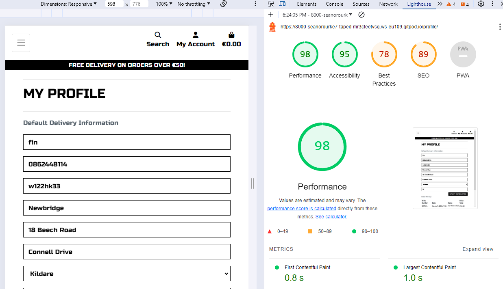

# Testing

This is the TESTING file for the [lucataped](https://taped-8201a532e6b6.herokuapp.com/) website.

Return back to the [README.md](README.md) file.

## Testing Contents  
  
- [Testing](#testing)
  - [Testing Contents](#testing-contents)
  - [Validation](#validation)
    - [HTML Validation](#html-validation)
    - [JavaScript Validation](#javascript-validation)
    - [Python Validation](#python-validation)
    - [CSS Validation](#css-validation)
    - [Lighthouse Scores](#lighthouse-scores)
  - [Manual Testing](#manual-testing)
    - [User Input/Form Validation](#user-inputform-validation)
    - [Browser Compatibility](#browser-compatibility)
    - [Responsiveness](#responsiveness)
    - [Testing User Stories](#testing-user-stories)
    - [Dev Tools/Real World Device Testing](#dev-toolsreal-world-device-testing)
  - [Bugs](#bugs)
    - [Unresolved/Known Bugs](#unresolvedknown-bugs)

## Validation

### HTML Validation

For my HTML files I have used [HTML W3C Validator](https://validator.w3.org) to validate all of my HTML files.

I have had to follow a different approach for validating my HTML for this project as the majority of my pages are developed using Jinja syntax such as '' and '{{ form|crispy }}' and most require user authentication. The HTML validator will throw errors if I were to use my website's URL so I have had to follow the below approach for every page:

- Via the deployed Heroku app link, I have navigated to each individual page.
- Right clicking on the screen/CTRL+U or ⌘+U on Mac, allows a menu to appear, giving me the option to 'View page source'.
- The complete HTML code for the deployed page will appear, allowing you to select the entire code using CTRL+A or ⌘+A on Mac.
- Paste the copied code into the [validate by input](https://validator.w3.org/#validate_by_input) option.
- Check for errors and warnings, fix any issues, revalidate by following the above steps and record the results.

  

All HTML pages were validated and received a 'No errors or warning to show' for code that I had written, result as shown above.

| HTML Source Code/Page | Errors | Warnings |
| ---- | ------ | -------- |
| Home | 0 | 0 |
| Log In | 0 | 0 |
| Register | 0 | 0 |
| All Products | 0 | 0 |
| Blog | 0 | 0 |
| Post detail | 0 | 0 |
| Bag - Empty | 0 | 0 |
| Bag - Products | 0 | 0 |
| Checkout | 0 | 0 |
| Profile | 0 | 0 |
| Order History | 0 | 0 |
| Forgot Password | 0 | 0 |
| Error 404 | 0 | 0 |
| Footer    | Privacy Policy | External link - N/A | External link - N/A |
| Admin create a Post | 0 | 0 |
| Admin Edit Post | 0 | 0 |
| Admin Delete Post | 0 | 0 |
| Admin Product List | 0 | 0 |
| Admin Product Detail | 0 | 0 |
| Admin Add Product | 0 | 0 |
| Admin Edit Product | 0 | 0 |
| Admin Delete Product | 0 | 0 |
| Admin Product Management | 0 | 0 |

There were several Errors/Warnings present as a result of Bootstraps form elements, not from the code that I have created. Issues with the name ID duplicates and issues with the `<strong>` and `
` tags are embedded within the Bootstrap forms and are inaccessible to me.

There are also issues with the iFrame in the post detail but this is from the tiktok videos loaded through django so again I can't access this code. 
All errors associated with code i've written has been fixed.

### JavaScript Validation

[JSHint](https://jshint.com/) was used to validate the JavaScript code added to the project. External JS, for Bootstrap, jQuery and Fontawesome purposes were not validated through JSHint.

No Major issues were detected. The only warning was around template literals only available in the latest version. 

### Python Validation

[CI Python Linter](https://pep8ci.herokuapp.com/#) was used to validate the Python files that were created or edited by myself. 
Apart from a few line lengths that I decided to leave as they were causing issues when changing No other issues were identified. 
I have included a screenshot with the results below.

### CSS Validation

[W3C CSS Validator](https://jigsaw.w3.org/css-validator/) was used to validate my CSS files. External CSS for Bootstrap, provided by [CDN](https://cdn.jsdelivr.net/npm/bootstrap@4.6.2/dist/css/bootstrap.min.css) was not tested.

### Lighthouse Scores

Lighthouse testing was carried out in Incognito mode to achieve the best result. Images used in the site's design were saved in png format, and compressed using [tinypng](https://tinypng.com/) to offer the best chance for a decent performance score.

| Page | Lighthouse Scores |
| ---- | ----------------- | -------- |
| All  |    |
| Read  |    |
| Account |      | 
| Wishlist |     |  

## Manual Testing

### User Input/Form Validation

Testing was carried out on desktop using a Chrome browser to ensure all forms take the intended input and process the input appropriately.

| Feature                    | Tested?  | User Input Required | User Feedback Provided     | Pass/Fail | Fix |
|----------------------------|----------|---------------------|----------------------------|-----------|-----|
| Navbar Logo and Icons      | Yes      | Click Links bring user to correct destination    | Text Colour Change on hover/Dropdowns | Pass | N/A |
| Home Page                  | Yes      | Hover/Click interactive features Links bring user to correct destination | | Pass | N/A |
| Register Page              | Yes      | Text Input/Click Links | Form field highlighted with placeholders + Toast message | Pass | N/A |
| Forgot Password            | Yes      | Text Input/Click Links | Form field highlight/Toast message | Pass | N/A |
| Log In Page                | Yes      | Text Input/Click Links | Form field highlight/Toast message | Pass | N/A |
| Log Out Page               | Yes      | Click Links bring user to correct destination | Button animation/Toast message | Pass | N/A |
| Account - Edit info        | Yes      | Text Input/Click to Save | Form field highlighted/Toast message | Pass | N/A |
| Search                     | Yes      | Text Input/Click to Search | Form field highlighted Placeholder "Search our Site" | Pass | N/A |
| Newsletter Sign Up         | Yes      | Text Input/ Click to Subscribe | Button animation/New tab subscription confirmation | Pass | N/A |
| Products                   | Yes      | Click product brings user to product description | Pointer change on hover of products | Pass | N/A |
| Add Product                | Yes      | Navigated to Admin "Product Management", clicked 'Add Product', Completed form, Form submits correctly to display the product. | Form field highlight/Button animation/Toast message, "Successfully added product!". | Pass | N/A |
| Delete Product             | Yes      | Navigated to a Product, clicked 'Delete Product'.| Toast message, "Product Deleted!". | Pass | N/A |
| Edit Product               | Yes      | Navigated to a Product clicked 'Edit Product', Completed form, Form submits correctly to display the edited product. | Form field highlight/Button animation/Toast message, "product updated sucessfully". | Pass | N/a |
| View Post                  | Yes      | Click link for article | Pointer change on hover | Pass | N/A |
| Create a Post              | Yes      | Navigated to Admin Dashboard, clicked 'Create a Post', Completed form, Form submits correctly to display the Post. | Form field highlight/Button animation/Toast message, If published "Created and published new post" otherwise "New post created as draft only.". | Pass | N/A |
| Edit Post                  | Yes      | Navigated to a Post Detail Page, clicked 'Edit Post', Completed form, Form submits correctly to display the edited article. | Form field highlight/Button animation/Toast message, Post edited successfully. | Pass | N/A |
| Product Quantity           | Yes      | Click increment/decrement | Colour change on hover/product quantity successfully changed | Pass | N/A |
| Product Sizes              | Yes      | Click dropdown/Click to select | Form field highlight/Size highlight | Pass | N/A |
| Checkout                   | Yes      | Click 'Secure Checkout', correct products in bag, entered delivery and payment details, submitted form to process payment. | Form field highlight/Button animation/Toast message, Loading spinner when processing order, order processed saved to account and email sent. | Pass | N/A |
| Footer                     | Yes      | Click Link brings user to social media sites, privacy policy and mailchimp sign up | Pointer change on hover | Pass | N/A |

### Browser Compatibility

lucataped was tested on the following browsers, purchases were made, blog posts/products added/edited/deleted, error pages, all features were accessible and working as intended:

- Chrome 
- Firefox 
- Safari 

### Responsiveness

Using the Bootstrap framework allowed a more rapid development of a responsive website. Starting with mobile first, lucataped was created to ensure the customer has an unhindered, positive experience when shopping. lucataped was regularly tested during development using Dev Tools to check for display issues on iPhone, Samsung Galaxy, iPad and laptop/desktop screen sizes. Once deployed to Heroku, lucataped was tested on real world devices. No major issues were detected. There were no major differences between desktop and tablet views thanks to the Bootstrap Grid system of columns.

### Testing User Stories

User Stories are documented in the lucataped [GitHub Projects Board](https://github.com/users/amylour/projects/6). User Stories are completed, with Acceptance Criteria and Tasks detailed within. Testing was carried out on Dev Tools for desktop/tablet/mobile, by creating multiple accounts for test users: Test01, Test02, Test03 etc and following through by ensuring that the Acceptance Criteria were met. All features were tested to ensure that they provided the user with the expected output and action.

| User Story                 | Acceptance Criteria Met?  | Tested | Response     | Pass/Fail | Fix     |
|----------------------------|---------------------------|--------|--------------|-----------|---------|
| As a **customer**, I can **view the site's home page** so that I can **understand the site's intentions and purpose**. | Yes | Yes | Home page is visible | Pass | n/a |
| As a **customer**, I can **see and use the navigation bar** so that I can **make my way around the site and get to where I would like**. | Yes | Yes | Navbar visible to all users in desktop/tablet and mobile views | Pass | n/a |
| As a **customer**, I can **enter text into the search bar** so that I can **search for a specific item**. | Yes | Yes | Search bar accepts user input and returns search results when search form is submitted | Pass | n/a |
| As a **customer** I can **create and manage an account with lucataped** so that I can **keep my personal details, order history and speed up my checkout process**. | Yes | Yes | Register form takes new user information. User may then sign in to view their account, edit their personal information and start saving their order histories from purchases made | Pass | n/a |
| As a **customer**, I can **edit my personal details on my account** so that I can **keep them up to date**. | Yes | Yes | User information is editable | Pass | n/a |
| As a **site user**, I can **enter my login details** so that I can **login in to my account**. | Yes | Yes | User may login with correct details | Pass | n/a |
|  As a **site user**, I can **click on the visible links in the footer** so that I can **view the relevant information and destinations**. | Yes | Yes | Footer links return user to relevant area in website and external links open in a new tab | Pass | n/a |
| As a **site user**, I can **register** so that I can **comment on blog posts**. | Yes | Yes | Registration process works as expected to accept new users | Pass | n/a |
| As a **site user** I can **interact with sorting and view features on the 'All Products' page** so that I can **improve my shopping experience on the site**. | Yes | Yes | Price, category, A-Z, rating works as expected to display products in a certain order. | Pass | n/a |
| As a **site user**, I can **click on a navbar item for a specific category** so that I can **choose to view a smaller amount of related products**. | Yes | Yes | Products sorted correctly into categories. | Pass | n/a |
| As a **customer**, I can **choose an individual product** so that I can **view its description, price, colours, sizes available etc**. | Yes | Yes | Individual products returned when clicked on, all relevant information displayed and is interactable. | Pass | n/a |
| As a **site admin** I can **add a product to my inventory using a frontend from** so that I can **increase my range/amount of products available on site**. | Yes | Yes | Add product form takes new information and displays it in the product template correctly. | Pass | n/a |
| As a **site admin**, I can **edit existing inventory from a frontend form** so I can **edit products description, price or image and set sale price**. | Yes | Yes | Edit product form takes user input and returns it correctly in the template. | Pass | n/a |
| As a **site admin**, I can **delete products from the inventory using a frontend form** so that I can **remove it from sale**. | Yes | Yes | 
| As a **customer** I can **create and manage an account with lucataped** so that I can **keep my personal details, order history and speed up my checkout process**. | Yes | Yes | Account functions as expected, all user information is handled appropriately and displayed within the account template | Pass | n/a |
| As a **customer**, I can **click on 'Add to Bag' in my product view**so that I can **add the product to my bag**. | Yes | Yes | Add to Bag works when clicked and product is added to bag and displayed in a success toast with the product displayed. A link to the bag is displayed in the toast message. | Pass | n/a |
| As a **customer**, I can **increase/decrease/remove quantities of a product in my bag** so that I can **have control over what I wish to purchase**. | Yes | Yes | Increment/Decrement/Remove buttons work as expected when clicked by user. | Pass | n/a |
| As a **customer**, I can **view my bag total from any page** so that I can **keep track of my potential spending**. | Yes | Yes | Bag item quantity is displayed with a shopping bag icon top right in navbar. | Pass | n/a |
| As a **customer**, I can **checkout my products securely** so that I can **complete my purchase**. | Yes | Yes | Payments handled correctly through Stripe's payment system, tested many times using the '4242424242...' Stripe testing card credentials. | Pass | n/a |
| As a **customer**, I can **receive an email after purchasing** so that I can **confirm my purchase and keep a record of my order**. | No | No | Email issue since google changed settings still working in this. |Fail | May need to change provider (hotmail etc.) |
| As a **site user** I can **view error pages with 'Home' links** so that I can **return to the main page if a page is missing or forbidden**. | Yes | Yes | Error pages display correctly when user attempts to access non-existent content, restricted content. | Pass | n/a |
| As a **customer**, I can **enter my details into the newsletter form** so I can **receive emails about products or new blog posts**. | Yes | Yes | Newsletter form submission brings user to new tab of MailChimp subscription confirmation. When checked, MailChimp subscription address book shows new user added. | Pass | n/a |

### Dev Tools/Real World Device Testing

Responsiveness testing was carried out using Google Dev Tools and on real world devices detailed within the below table. Responsiveness was evident on all features throughout all tested devices.

**Real World Device Testing**
| Device      | Feature    | Issue  | Fix  |
| ------------| ---------- | ------ |------|
| iPhone 11 | entire site | none |n/a |
| Samsung s22 | entire site | none |n/a |
| OPPO | entire site | none |n/a |
| Samsung 10 Tab | entire site | none |n/a |

## Bugs

| No. | Bug | Solved | Fix | Solution Credit |
| --- | --- | ------ | --- | --------------- |
| 1   | Emails not sending | No | Still working on a solution may be due to google settings change. May need to change provider | Still working on it. |
| 2   | Slug not auto generting on new blog posts. | Yes | Couldn't get the slugify to auto generate a slug so I have left the slugfield open to the admin so they can set a unique sluf when generating the post as a temporary fix. There are instructions for the admin as a placeholder and the input field has been renamed URL | Myself, still working on a permanent solution | 
| 3  | Country drop down option from django not working with stripe form | Yes | I changed the model to have the counties of Ireland as a dropdown and to use eircode instead of postcode but this had an impact on using the django countries dropdown code. As a solution I didn't use the django countries and instead set the placeholder of country to IE. The store is designed to only deliver to ireland at the moment hence the eircode and county dropdown menus. | Fixed by me |

### Unresolved/Known Bugs

There are no known bugs that impact the user experrience in lucataped.